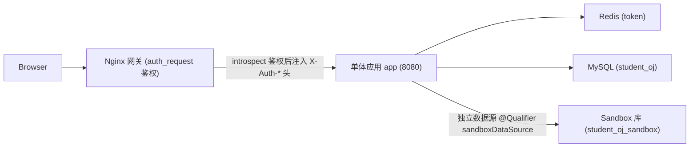

# 智能 SQL OJ 判题系统（单体架构版 v2.0）

智能 SQL OJ 判题系统包含学生端、教师端、单体后端、容器化部署与测试方案。

> v2.0 架构说明：原 8 个 Spring Boot 微服务（auth / problem / judge / sandbox / ai / statistics / teacher + auth-common）已合并为单一应用模块 `backend/app`，跨服务通信全部改为**进程内直接调用**，移除了 RabbitMQ 与服务间 HTTP 调用，仅依赖 MySQL + Redis。

## 技术栈

- 前端：Vue3、TypeScript、Vite、Element Plus、Pinia、ECharts、Monaco Editor
- 后端：Java 21、Spring Boot 3、MyBatis Plus（单体应用，单端口 8080）
- 基础设施：MySQL 8.4、Redis 7.4、Docker、Nginx
- AI：DeepSeek 大模型（OpenAI 兼容接口），未配置密钥时自动回退规则生成器

## 项目结构

```text
.
├─ src                         # 前端源码（Vue3 + Vite）
├─ dist                        # 前端构建产物
├─ backend
│  ├─ app                      # 单体应用（启动类 com.studentoj.StudentOjApplication）
│  │  └─ src/main/java/com/studentoj
│  │     ├─ auth               # 认证鉴权
│  │     ├─ problem            # 题目与提交
│  │     ├─ judge              # 判题（进程内直调 sandbox）
│  │     ├─ sandbox            # SQL 沙箱执行（独立数据源）
│  │     ├─ ai                 # AI 建议
│  │     ├─ statistics         # 统计与活跃度
│  │     ├─ teacher            # 教师管理
│  │     ├─ common             # 公共组件
│  │     └─ leetcodecrawler    # 题库爬虫
│  ├─ Dockerfile               # 后端通用服务镜像（SERVICE_NAME=app）
│  └─ pom.xml                  # 父 pom（保留原微服务目录作回退）
├─ deploy
│  ├─ mysql                    # 初始化脚本与题库种子
│  └─ nginx                    # 网关配置（含单体版 monolith-compose.conf）
├─ Dockerfile                  # 前端 Nginx 镜像
├─ Dockerfile.monolith-web     # 单体版前端 + nginx 网关镜像
├─ docker-compose.monolith.yml # 单体架构部署编排（推荐）
├─ docker-compose.yml          # 旧 8 微服务编排（保留作回退）
└─ .github/workflows/ci.yml
```

## 本地前端运行

```bash
npm install
npm run dev
```

访问：

```text
http://localhost:5173
```

## 本地后端运行

需要 JDK 21。打包单体应用：

```bash
mvn -f backend/pom.xml -pl app -am -DskipTests package
```

启动（需要先准备好 MySQL 与 Redis）：

```bash
java -jar backend/app/target/app-*.jar
```

单体应用默认监听端口 `8080`，所有 `/api/*` 接口由该进程统一提供。

## Docker 部署（推荐）

单体架构一条命令启动全栈（MySQL + Redis + 单体后端 app + 前端网关 web）：

```bash
docker compose -f docker-compose.monolith.yml up -d --build
```

浏览器访问：

```text
http://localhost
```

如需清空数据卷重新执行初始化脚本：

```bash
docker compose -f docker-compose.monolith.yml down -v
docker compose -f docker-compose.monolith.yml up -d --build
```

服务构成：

```text
mysql   MySQL 8.4    宿主 3307 -> 3306
redis   Redis 7.4    6379
app     单体后端      宿主 18080 -> 8080（调试直连，可移除）
web     Nginx 网关    80
```

> MySQL 初始化按文件名序执行：`01-init.sql` 建表与基础种子，`02-problems.sql` 灌入题库（323 题）。

### 组件账号密码

| 组件 | 访问地址 | 默认账号 | 密码 | 说明 |
| --- | --- | --- | --- | --- |
| 前端系统 | `http://localhost` | `teacher01` | `123456` | 教师端测试账号 |
| 前端系统 | `http://localhost` | `student01` ~ `student12` | `123456` | 学生端测试账号 |
| MySQL | `localhost:3307` | `root` | `root` | 默认数据库：`student_oj` |
| Sandbox MySQL | 容器内访问 | `sandbox` | `sandbox123` | 仅授权访问 `student_oj_sandbox` |
| Redis | `localhost:6379` | 无 | 无 | 未配置密码 |
| Nginx | `http://localhost` | 无 | 无 | 前端静态资源与 API 反向代理入口 |


## 架构图



进程内直调链路（取代原 RabbitMQ 异步链路）：

```text
ProblemService.submit()
  -> JudgeService.judge()        同步判题
     -> SandboxService.execute() 独立数据源执行 SQL
  -> 更新 submission 结果
  -> ActivityRecorder.record()   幂等记录活跃度
```

关键设计：

- **双数据源**：主库 `dataSource` 标 `@Primary`，业务 Mapper 默认走它；`sandboxDataSource` 物理隔离（独立账号 `sandbox`、独立库 `student_oj_sandbox`），`SandboxService` 用 `@Qualifier("sandboxDataSource")` 注入。
- **鉴权**：单体部署在 Nginx 网关后，网关 `auth_request` -> `introspect` 拿身份，再注入 `X-Internal-Auth` 与 `X-Auth-User-Id/Username/Role` 到下游；`/api/auth/login`、`/api/auth/introspect` 为公开端点直接放行。

## DevOps

### Dockerfile

- 根目录 `Dockerfile`：构建前端并通过 Nginx 托管静态资源。
- `Dockerfile.monolith-web`：容器内 npm build 前端 + 打包进 Nginx，使用 `deploy/nginx/monolith-compose.conf`。
- `backend/Dockerfile`：多阶段 Maven 构建 + Temurin JRE，通过 `SERVICE_NAME=app` 构建单体应用。

### Nginx

| 配置文件 | 用途 |
| --- | --- |
| `deploy/nginx/monolith-compose.conf` | 单体 compose 版，上游指向容器服务名 `app:8080` |
| `deploy/nginx/monolith.conf` | 单体宿主版，上游指向 `host.docker.internal:18080` |
| `deploy/nginx/default.conf` | 旧 8 微服务版（保留作回退） |

职责：托管 Vue 前端静态资源、SPA fallback 到 `index.html`、`auth_request` 鉴权并将 `/api/*` 反向代理到单体后端。

### GitHub Actions

配置文件 `.github/workflows/ci.yml`，流水线包含前端 `npm ci` / `npm run build`、后端 `mvn test`、Docker 配置校验。


## 测试方案

### 单元测试

覆盖 controller、service、mapper 基础逻辑，保证判题、提交、统计、教师管理等核心流程稳定。

- 认证：登录参数、角色返回、token 返回。
- 题目：列表、详情、提交创建。
- 判题：ACCEPTED / WRONG_ANSWER / TIME_LIMIT / RUNTIME_ERROR 状态判断。
- 沙箱：SQL 白名单校验、危险 SQL 拦截、超时返回。
- AI：建议生成、空输入处理、失败兜底。
- 统计：当天活跃 upsert、通过率、趋势。
- 教师：学生分组、成绩导出、题目导入参数校验。

建议工具：JUnit 5、Mockito、Spring Boot Test、H2。

### 集成测试

验证模块间进程内协作与数据库 / Redis 联动。核心链路：

```text
提交 SQL -> 同步判题 -> 沙箱执行 -> 更新 submission -> 写活跃度统计 -> AI 建议
```

关键用例：

- 正确 SQL 提交后变为 ACCEPTED（score=100）。
- 错误 SQL 返回 WRONG_ANSWER 或 RUNTIME_ERROR。
- 当天首次提交写入 student_activity（幂等）。
- 教师导出能拿到提交与统计数据。
- AI 服务不可用时不影响判题主链路。

建议工具：Testcontainers、Spring Boot Test、WireMock。

### 压测

验证课堂并发提交场景，发现沙箱执行、数据库写入瓶颈。

场景：100 并发登录、300 并发拉题、200 并发提交、教师端导出 1 万条成绩。

核心指标：提交接口 P95 < 300ms；普通 SQL 判题 P95 < 5s；MySQL CPU / 连接数 / 慢查询可控；沙箱容器资源隔离有效。

建议工具：JMeter、k6、Gatling。

### 安全测试

- 权限：学生不能访问教师管理接口。
- SQL 安全：禁止 DROP / DELETE / UPDATE / INSERT / ALTER / CREATE 等危险语句。
- 沙箱隔离：限制 CPU、内存、执行时间、网络访问。
- 输入校验：题目导入、成绩导出、AI prompt。
- 认证安全：JWT 过期、伪造 token、越权访问。
- Web 安全：XSS、CSRF、CORS、敏感信息泄露。

建议工具：OWASP ZAP、sqlmap（仅测试环境）、Trivy、Dependabot。

## 验证记录

- 后端：`mvn -pl app -DskipTests package` 通过，可执行 jar 完整启动 Spring 上下文（~22s，无 bean 冲突）。
- 端到端：docker-compose 单体栈经 web:80 验证功能正常，判题链路（problem -> judge -> sandbox 进程内直调）+ 活跃度幂等写入全部打通。
- 前端：`npm run build` 构建通过。

