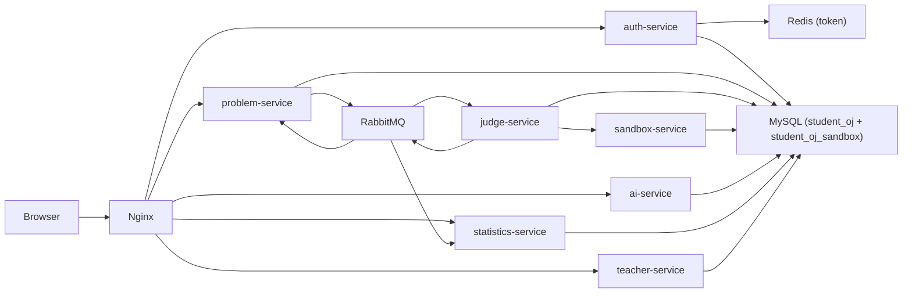

# 智能 SQL OJ 判题系统

智能 SQL OJ 判题系统包含学生端、教师端、后端微服务、容器化部署、监控与测试方案。

## 技术栈

- 前端：Vue3、TypeScript、Vite、Element Plus、Pinia、ECharts、Monaco Editor
- 后端：Java 21、Spring Boot 3、MyBatis Plus
- 基础设施：MySQL、Redis、RabbitMQ、Docker、Nginx
- 监控：Prometheus、Grafana、Spring Boot Actuator
- AI：DeepSeek 大模型（OpenAI 兼容接口），未配置密钥时自动回退规则生成器

## 项目结构

```text
.
├─ src                         # 前端源码
├─ backend                     # Spring Boot 多模块后端
│  ├─ auth-service
│  ├─ problem-service
│  ├─ judge-service
│  ├─ sandbox-service
│  ├─ ai-service
│  ├─ statistics-service
│  └─ teacher-service
├─ deploy
│  ├─ nginx
│  ├─ prometheus
│  └─ grafana
├─ Dockerfile                  # 前端 Nginx 镜像
├─ backend/Dockerfile          # 后端通用服务镜像
├─ docker-compose.yml
└─ .github/workflows/ci.yml
```

## 本地前端运行

```bash
npm install
npm run dev
```

访问：

```text
http://localhost:5173
```

## 本地后端运行

需要 JDK 21。

```bash
mvn -f backend/pom.xml test
```

单服务启动示例：

```bash
mvn -f backend/auth-service/pom.xml spring-boot:run
mvn -f backend/problem-service/pom.xml spring-boot:run
```

服务端口：

```text
auth-service        8081
problem-service     8082
judge-service       8083
sandbox-service     8084
ai-service          8085
statistics-service  8086
teacher-service     8087
```

## Docker 部署

```bash
docker compose up --build
```

如需清空 MySQL 数据卷并重新执行初始化脚本：

```bash
docker compose down -v
docker compose up --build -d
```

访问入口：

```text
前端/Nginx:    http://localhost
Prometheus:   http://localhost:9090
Grafana:      http://localhost:3000
RabbitMQ UI:  http://localhost:15672
```

### 组件账号密码

| 组件 | 访问地址 | 管理员/默认账号 | 密码 | 说明 |
| --- | --- | --- | --- | --- |
| 前端系统 | `http://localhost` | `teacher01` | `123456` | 教师端测试账号 |
| 前端系统 | `http://localhost` | `student01` ~ `student12` | `123456` | 学生端测试账号 |
| MySQL | `localhost:3307` | `root` | `root` | 默认数据库：`student_oj` |
| Sandbox MySQL | 容器内访问 | `sandbox` | `sandbox123` | 仅授权访问 `student_oj_sandbox` |
| Redis | `localhost:6379` | 无 | 无 | 当前 docker-compose 未配置 Redis 密码 |
| RabbitMQ 管理台 | `http://localhost:15672` | `guest` | `guest` | RabbitMQ 官方镜像默认账号 |
| Prometheus | `http://localhost:9090` | 无 | 无 | 当前未开启认证 |
| Grafana | `http://localhost:3000` | `admin` | `admin` | 由 `GF_SECURITY_ADMIN_USER` / `GF_SECURITY_ADMIN_PASSWORD` 配置 |
| Nginx | `http://localhost` | 无 | 无 | 仅作为前端静态资源与 API 反向代理入口 |

## 架构图



## DevOps

### Dockerfile

- 根目录 `Dockerfile`：构建前端并通过 Nginx 托管静态资源。
- `backend/Dockerfile`：通过 `SERVICE_NAME` 构建指定 Spring Boot 服务。

### docker-compose

`docker-compose.yml` 包含：

- MySQL
- Redis
- RabbitMQ
- 7 个 Spring Boot 服务
- Nginx 前端入口
- Prometheus
- Grafana

### Nginx

配置文件：

```text
deploy/nginx/default.conf
```

职责：

- 托管 Vue 前端静态资源
- SPA fallback 到 `index.html`
- 将 `/api/*` 反向代理到对应后端服务

### GitHub Actions

配置文件：

```text
.github/workflows/ci.yml
```

流水线：

- 前端：`npm ci`、`npm run build`
- 后端：JDK 21、`mvn -f backend/pom.xml test`
- Docker：`docker compose config`

### Prometheus

配置文件：

```text
deploy/prometheus/prometheus.yml
```

采集目标：

```text
/actuator/prometheus
```

### Grafana

配置目录：

```text
deploy/grafana
```

包含：

- Prometheus datasource provisioning
- SQL OJ Overview dashboard

## QA 方案

### 单元测试方案

目标：

- 覆盖 controller、service、mapper 基础逻辑。
- 保证判题、提交、统计、教师管理等核心流程的稳定性。

测试范围：

- auth-service：登录参数、角色返回、token 返回。
- problem-service：题目列表、题目详情、提交创建。
- judge-service：ACCEPTED、WRONG_ANSWER、TIME_LIMIT、RUNTIME_ERROR 状态判断。
- sandbox-service：SQL 白名单校验、危险 SQL 拦截、超时返回。
- ai-service：AI 建议生成、空输入处理、失败兜底。
- statistics-service：当天活跃 upsert、通过率统计、趋势统计。
- teacher-service：学生分组、成绩导出任务、题目导入参数校验。

建议工具：

- JUnit 5
- Mockito
- Spring Boot Test
- MyBatis Plus 测试可用 H2

### 集成测试方案

目标：

- 验证服务之间 API 协作。
- 验证 MQ 消息链路。
- 验证数据库、Redis、RabbitMQ 联动。

核心链路：

```text
problem-service 创建 submission
→ RabbitMQ submission.created
→ judge-service 判题
→ sandbox-service 执行 SQL
→ judge.finished
→ statistics-service 更新统计
→ ai-service 生成建议
```

建议工具：

- Testcontainers
- Spring Boot Test
- WireMock
- Docker Compose test profile

关键用例：

- 学生提交 SQL 后最终变为 ACCEPTED。
- 错误 SQL 返回 WRONG_ANSWER 或 RUNTIME_ERROR。
- 当天首次提交写入 student_activity。
- 教师导出成绩能拿到提交与统计数据。
- AI 服务不可用时不影响判题主链路。

### 压测方案

目标：

- 验证课堂并发提交场景。
- 发现判题队列、沙箱执行、数据库写入瓶颈。

建议工具：

- JMeter
- k6
- Gatling

压测场景：

- 100 并发学生登录。
- 300 并发拉取题目列表。
- 200 并发提交 SQL。
- 1000 条提交消息进入 RabbitMQ。
- 教师端导出 1 万条成绩记录。

核心指标：

- 提交接口 P95 响应时间小于 300ms。
- 普通 SQL 判题 P95 完成时间小于 5s。
- RabbitMQ 队列积压可控。
- MySQL CPU、连接数、慢查询可控。
- Sandbox 容器资源隔离有效。

### 安全测试方案

目标：

- 防止 SQL 执行逃逸。
- 防止未授权访问教师端数据。
- 防止基础 Web 漏洞。

测试范围：

- 权限测试：学生不能访问教师管理接口。
- SQL 安全：禁止 DROP、DELETE、UPDATE、INSERT、ALTER、CREATE 等危险语句。
- 沙箱隔离：限制 CPU、内存、执行时间、网络访问。
- 输入校验：题目导入、成绩导出、AI prompt 输入。
- 文件上传：限制扩展名、大小、内容类型。
- 认证安全：JWT 过期、伪造 token、越权访问。
- Web 安全：XSS、CSRF、CORS、敏感信息泄露。

建议工具：

- OWASP ZAP
- sqlmap，仅用于测试环境
- Trivy 镜像扫描
- GitHub Dependabot
- Docker Bench Security

## 验证记录

当前机器安装的是 JDK 17，工程默认是 Java 21。已使用兼容参数完成本地验证：

```bash
mvn -f backend/pom.xml "-Djava.version=17" test
```

结果：7 个后端服务上下文测试通过。

前端已验证：

```bash
npm run build
```

结果：构建通过。
